# AV Evaluation Agent 배포 운영 절차서

## 1. 패키지 구성

| 경로 | 용도 |
|---|---|
| `app/` | FastAPI 백엔드, LangGraph 실행 로직 |
| `n8n/` | n8n 워크플로우 JSON |
| `schemas/` | 시나리오, run manifest, KPI JSON 스키마 |
| `evals/` | 고정 평가 케이스, 평가 실행기 |
| `examples/` | 시나리오 1, 2 요청 예시 |
| `deploy_scripts/` | 설치, 실행, import, 터널, 종료 스크립트 |
| `docker-compose.yml` | n8n 컨테이너 구성 |
| `.env.example` | 환경 변수 템플릿 |
| `DEPLOYMENT_MANIFEST.json` | 배포본 구성 정보 |

## 2. 대상 PC 요구사항

| 항목 | 조건 |
|---|---|
| OS | Windows 10/11 |
| Docker | Docker Desktop |
| Python | 3.10 이상 |
| CARLA/OpenCDA | 실제 시뮬레이션 실행 시 필요 |
| OpenAI API Key | GPT 기반 자동 조정 사용 시 필요 |
| Slack Webhook 또는 Credential | Human-in-the-loop 알림 사용 시 필요 |

## 3. 실행 범위

| 모드 | CARLA/OpenCDA 필요 여부 | 결과 |
|---|---|---|
| report-only | 불필요 | 정의서, 계획, 보고서 경로 생성 |
| dry-run | 불필요 | 실행 명령 계획 검증 |
| simulation | 필요 | CARLA/OpenCDA 실행, 로그/KPI/보고서 생성 |

## 4. 초기 설정

```powershell
cd C:\path\to\av_eval_agent_deploy_package
Copy-Item .env.example .env
notepad .env
```

필수 확인 항목:

```text
OPENCDA_ROOT=
OPENAI_API_KEY=
SLACK_WEBHOOK_URL=
AV_AGENT_WEBHOOK_TOKEN=
```

## 5. 설치

```powershell
powershell -ExecutionPolicy Bypass -File .\deploy_scripts\install_windows.ps1
```

## 6. 백엔드 실행

```powershell
powershell -ExecutionPolicy Bypass -File .\deploy_scripts\start_backend.ps1
```

확인:

```powershell
Invoke-RestMethod http://127.0.0.1:8010/health
```

## 7. n8n 실행

```powershell
powershell -ExecutionPolicy Bypass -File .\deploy_scripts\start_n8n_docker.ps1
```

접속:

```text
http://127.0.0.1:5678
```

## 8. n8n 워크플로우 import

```powershell
powershell -ExecutionPolicy Bypass -File .\deploy_scripts\import_n8n_workflows.ps1
```

import 대상:

| 파일 | 역할 |
|---|---|
| `av_eval_agent_workflow.submission_sanitized.json` | 기본 오케스트레이션 |
| `av_eval_agent_async_submit.workflow.json` | 장시간 실행 비동기 제출 |
| `av_eval_agent_workflow.template.json` | 편집용 템플릿 |

## 9. 상태 점검

```powershell
powershell -ExecutionPolicy Bypass -File .\deploy_scripts\check_health.ps1
```

점검 대상:

| 대상 | URL/명령 |
|---|---|
| 백엔드 | `http://127.0.0.1:8010/health` |
| n8n | `http://127.0.0.1:5678/healthz` |
| 컨테이너 | `docker ps --filter name=av-eval-n8n` |

## 10. 샘플 요청

시나리오 2 report-only:

```powershell
powershell -ExecutionPolicy Bypass -File .\deploy_scripts\run_sample_request.ps1 -Scenario scenario2
```

시나리오 1 report-only:

```powershell
powershell -ExecutionPolicy Bypass -File .\deploy_scripts\run_sample_request.ps1 -Scenario scenario1
```

시뮬레이션 실행:

```powershell
powershell -ExecutionPolicy Bypass -File .\deploy_scripts\run_sample_request.ps1 -Scenario scenario2 -ExecuteSimulation -RunKpis
```

## 11. 외부 접속용 터널

```powershell
powershell -ExecutionPolicy Bypass -File .\deploy_scripts\start_tunnel.ps1
```

공유 대상:

```text
https://...trycloudflare.com
```

터널 조건:

| 항목 | 조건 |
|---|---|
| PC 전원 | 켜짐 |
| Docker | 실행 중 |
| n8n | 실행 중 |
| cloudflared | 실행 중 |

## 12. 종료

```powershell
powershell -ExecutionPolicy Bypass -File .\deploy_scripts\stop_all.ps1
```

## 13. 실행 흐름

```mermaid
flowchart LR
  A["자연어 요청"] --> B["ScenarioSpecAgent"]
  B --> C["ScenarioValidationAgent"]
  C --> D["ExperimentBuildAgent"]
  D --> E["SimulationRunAgent"]
  E --> F["KPIAgent"]
  F --> G["QualityGateAgent"]
  G --> H["ResearchReadinessAgent"]
  H --> I["ReportAgent"]
  I --> J["Human Review"]
```



## 14. 산출물

| 파일 | 내용 |
|---|---|
| `scenario_definition.json` | 시나리오 정의서 JSON |
| `scenario_definition_form.csv` | 정의서 표 형식 |
| `execution_plan.json` | OpenCDA 실행 계획 |
| `kpi_plan.json` | KPI 산출 계획 |
| `run_manifest.json` | 산출물 목록 및 상태 |
| `quality_gate.json` | 품질 게이트 결과 |
| `research_readiness.json` | 제출 준비도 |
| `final_run_report.md` | 최종 보고서 |

## 15. 배포 제외 항목

| 항목 | 처리 |
|---|---|
| CARLA 실행 파일 | 대상 PC 별도 설치 |
| OpenCDA 원본 환경 | 대상 PC 별도 설치 |
| OpenAI API Key | `.env` 또는 n8n credential 등록 |
| Slack Secret | n8n credential 또는 webhook 등록 |
| 대용량 영상/센서 데이터 | run 산출물 폴더 별도 보관 |
