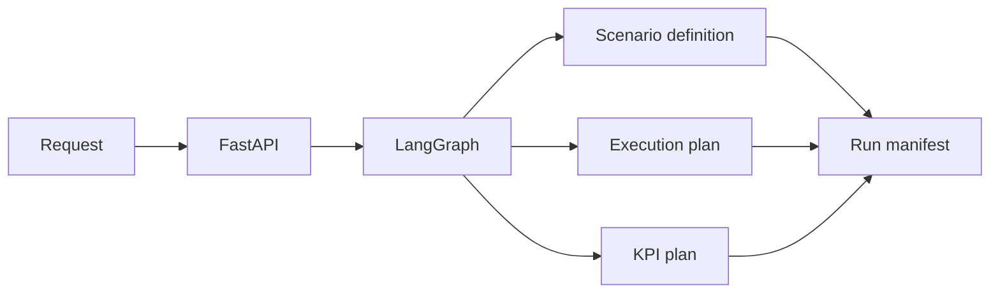

# Agent Architecture

## Scope

| Item | Value |
|---|---|
| input | natural-language AV evaluation request |
| output | scenario definition, execution plan, KPI plan, run manifest |
| backend | FastAPI + LangGraph |
| orchestration | n8n |
| simulator | external OpenCDA/CARLA |
| local mode | dry-run |

## Flow



## Backend Files

| File | Role |
|---|---|
| `app/main.py` | API endpoints |
| `app/graph.py` | LangGraph state graph |
| `app/state.py` | shared state schema |
| `app/services/scenario_definition_template.py` | base scenario table |
| `app/services/scenario_definition_autofill.py` | missing value fill |
| `app/services/scenario_alignment.py` | request-definition alignment |
| `app/services/opencda_runner.py` | OpenCDA command plan |
| `app/services/kpi_runner.py` | KPI command plan |
| `app/services/artifact_store.py` | run artifacts |
| `app/services/run_artifact_tracker.py` | manifest updates |
| `app/services/research_readiness.py` | submission checks |
| `app/services/autotune_agent.py` | tuning candidates |

## State Steps

| Step | Output |
|---|---|
| understand request | intent, scenario type, requested actions |
| specify scenario | `scenario_definition.json` |
| validate scenario | warnings, errors |
| plan experiment | `execution_plan.json` |
| plan KPI | `kpi_plan.json` |
| approval gate | approval flag |
| artifact planning | `run_manifest.json` |

## API

| Endpoint | Output |
|---|---|
| `GET /health` | service status |
| `POST /run/start` | `run_id`, initial artifacts |
| `POST /run/prepare/{run_id}` | execution and KPI plans |
| `POST /run/execute/{run_id}` | dry-run or external execution result |
| `GET /run/status/{run_id}` | run status |
| `GET /run/result/{run_id}` | manifest |
| `POST /pipeline/submit` | async run registration |
| `GET /pipeline/status/{run_id}` | async status |

## Run Artifacts

```text
av_eval_agent/data/runs/<run_id>/
  scenario_definition.json
  scenario_definition_form.json
  scenario_definition_form.csv
  run_manifest.json
  execution_plan.json
  agent_state.json
  experiment_plan.json
  kpi_plan.json
  generated_files/
  logs/
  report/
  dashboard/
```

## KPI Contract

| Axis | KPI |
|---|---|
| perception | MOTA, MOTP |
| traffic impact | Progress-adjusted Delay, Flow Efficiency |
| driving safety | Min 2D TTC, PET, Required Deceleration |
| control | Acceleration Variance Max, Yaw-rate Residual RMS |

## External Boundary

| Local | External |
|---|---|
| request parsing | CARLA runtime |
| scenario definition | OpenCDA checkout |
| command planning | simulator assets |
| evals | raw simulation dumps |
| API dry-run | long-running simulator worker |
