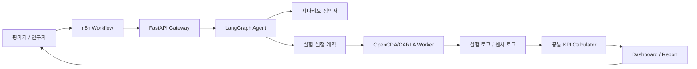
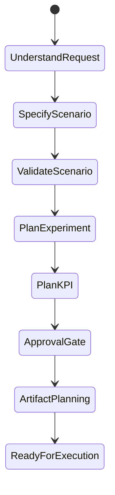

# 자율주행 평가 AI Agent 설계안

## 1. 설계 목표

본 Agent는 평가자가 자연어로 시험 의도를 입력하면, 이를 평가기관형 시나리오 정의서로 구조화하고, OpenCDA/CARLA 실험 실행과 KPI 산출까지 연결하는 자동화 시스템이다.

목표는 단순한 챗봇이나 보조 도구가 아니라, 평가기관이 반복적으로 수행하는 다음 업무를 하나의 Agent workflow로 묶는 것이다.

```text
시나리오 의도 입력
-> 시나리오 정의서 생성
-> 시험 조건 검증
-> OpenCDA/CARLA 실행 계획 생성
-> 실험 로그 저장
-> 공통 KPI 계산
-> 대시보드/보고서 생성
```

## 2. 전체 구조



## 3. 구성요소 역할

| 구성요소 | 역할 | 이유 |
|---|---|---|
| n8n | webhook, 승인 단계, 반복 실행, 상태 polling | 사람이 보는 workflow와 외부 시스템 연동에 적합 |
| FastAPI | n8n, LangGraph, OpenCDA를 연결하는 API gateway | 실행 상태와 산출물 경로를 표준 API로 관리 |
| LangGraph | 자연어 이해, 정의서 생성, 검증, KPI 계획 수립 | Agent 판단 흐름을 명시적인 state machine으로 관리 |
| OpenCDA/CARLA Worker | 실제 가상 실험 실행 | 차량/센서/교통 상황 시뮬레이션 |
| KPI Calculator | 공통 평가 지표 계산 | 시나리오가 달라도 동일한 평가 축 유지 |
| Dashboard/Report | 평가 결과 시각화 | 평가기관 제출 또는 데모에 필요한 결과물 |

## 4. LangGraph 상태 흐름



| 상태 | 산출물 |
|---|---|
| UnderstandRequest | 사용자 의도, 시나리오 유형, 실행/KPI 요청 여부 |
| SpecifyScenario | `scenario_definition.json`, `scenario_definition_form.json` |
| ValidateScenario | validation warning/error |
| PlanExperiment | OpenCDA PY/YAML 복사본 목록, 실행 전략 |
| PlanKPI | 공통 KPI contract, 계산 정책 |
| ApprovalGate | 승인 필요 여부와 이유 |
| ArtifactPlanning | `run_id`, 저장 경로, 산출물 구조 |

## 5. 시나리오 정의서 표준

기준 문서:

```text
C:/Users/User/Desktop/연구 관련 파일/(과-19)시나리오 정의서 (2).pdf
```

Agent는 위 PDF의 6-layer 형식을 따른다.

| 레이어 | 내용 |
|---|---|
| 레이어 1 | 평면 데이터 |
| 레이어 2 | 입체 데이터 |
| 레이어 3 | 가변시설 및 임시시설 데이터 |
| 레이어 4 | 시나리오 참여자 데이터 |
| 레이어 5 | 주변환경 데이터 |
| 레이어 6 | 디지털 데이터 |

표 컬럼은 항상 다음과 같다.

```text
레이어 / 항목 / 요소 / 설명 / 시험 시나리오
```

즉 시나리오가 1번이든 2번이든 정의서 형식은 고정되고, 각 행의 `시험 시나리오` 값만 달라진다.

## 6. KPI 표준

시나리오가 무엇이든 KPI는 동일한 contract로 계산한다.

| 평가축 | KPI |
|---|---|
| 인지 | MOTA, MOTP |
| 교통 영향성 | Progress-adjusted Delay, Flow Efficiency |
| 주행 안전성 | Min 2D TTC, PET, Required Deceleration |
| 제어 성능 | Acceleration Variance Max, Yaw-rate Residual RMS |

이 구조를 택한 이유는 평가기관 관점에서 시나리오별로 지표가 바뀌면 차량 간 비교가 어려워지기 때문이다. 시나리오는 입력 조건이고, KPI는 평가 기준이므로 분리해서 관리한다.

## 7. API

| endpoint | 기능 |
|---|---|
| `POST /run/start` | 자연어 요청을 받아 run 생성 |
| `POST /run/prepare/{run_id}` | OpenCDA/KPI 실행 계획 생성 |
| `POST /run/execute/{run_id}` | dry-run 또는 실제 OpenCDA/KPI 실행 |
| `GET /run/status/{run_id}` | run 상태와 산출물 조회 |
| `GET /run/result/{run_id}` | manifest 전체 조회 |

## 8. run 산출물 구조

```text
av_eval_agent/data/runs/<run_id>/
  scenario_definition.json
  scenario_definition_form.json
  scenario_definition_form.csv
  run_manifest.json
  execution_plan.json
  agent_state.json
  experiment_plan.json
  kpi_plan.json
  generated_files/
  logs/
  report/evaluation_agent_plan.md
  dashboard/index.html
```

## 9. 평가기관형 black-box 평가 흐름

평가기관은 제출 차량 내부 알고리즘을 직접 열어보지 않는 black-box 방식에 가깝게 평가할 수 있다. 이 시스템은 차량 내부 모델을 요구하지 않고 다음만 표준화한다.

- 시험 시나리오 정의서
- OpenCDA/CARLA 입력 조건
- 실험 로그와 센서 로그
- KPI 계산 기준
- 평가 결과 dashboard/report

따라서 차량이나 알고리즘이 달라져도 같은 시나리오와 같은 KPI 기준으로 비교할 수 있다.

## 10. 향후 고도화

1. 자연어에서 더 많은 정의서 값을 자동 추출한다.
2. 누락된 값은 YAML/Python 파일에서 자동 보완한다.
3. 실험 종료 후 최신 로그를 manifest에 자동 연결한다.
4. KPI 결과를 radar plot과 점수표로 자동 변환한다.
5. n8n에서 반복 실험, parameter sweep, 승인 절차를 확장한다.
6. 최종 결과를 평가기관 제출용 PDF/HTML 리포트로 자동 생성한다.
