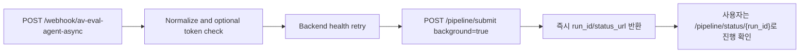

# 평가기관 제출용 Agent 아키텍처 설명서

## 1. 핵심 정리

본 시스템은 n8n 화면에 노드를 배치한 단순 자동화가 아니라, 다음 세 계층이 결합된 자율주행 평가 Agent이다.

| 계층 | 역할 | 구현 위치 |
| --- | --- | --- |
| n8n orchestration layer | 요청 수신, Agent endpoint 호출, Slack/HITL, 피드백 재진입, 외부 시스템 연동 | `av_eval_agent/n8n/` |
| FastAPI + LangGraph backend | 자연어 시나리오 해석, 정의서 JSON 생성, 검증, OpenCDA 실행, KPI 계산, 보고서 생성 | `av_eval_agent/app/` |
| OpenCDA/CARLA runtime | 실제 시뮬레이션, 로그, 센서 데이터, data dump 생성 | OpenCDA repository |

중요한 구분은 다음과 같다.

- n8n은 Agent의 운영 그래프이다.
- 실제 추론, 상태 전이, 시나리오 정의서 생성, 실행 계획 생성은 FastAPI backend에서 수행한다.
- backend 내부에는 `langgraph.graph.StateGraph` 기반 흐름이 존재한다.
- 따라서 제출용 명칭은 `LangGraph Workflow`가 아니라 `AV Evaluation Agent - n8n Orchestration Layer`로 둔다.

## 2. Agent 흐름

```mermaid
flowchart LR
    A["사용자 자연어 시나리오 요청"] --> B["n8n Normalize/Auth"]
    B --> C["KnowledgePackAgent"]
    C --> D["BackendRuntimeGuard"]
    D --> E["ScenarioSpecAgent"]
    E --> F["ScenarioValidationAgent"]
    F --> G["ExperimentBuildAgent"]
    G --> H["SimulationRunAgent"]
    H --> I["KPIAgent"]
    I --> J["FailureDiagnosisAgent"]
    J --> K["RunQualityGateAgent"]
    K --> L["ResearchReadinessAgent"]
    L --> M["ReportAgent"]
    M --> N["MemoryAgent"]
    N --> O["AutoTuneAgent"]
    O --> P["Human-in-the-loop Review"]
    P --> Q["Slack or Fallback Review Package"]
    Q --> R["Feedback Webhook"]
    R --> B
```

## 3. 실제 호출 가능한 Agent endpoint

| Agent | backend endpoint | 기능 |
| --- | --- | --- |
| KnowledgePackAgent | `GET /agent/knowledge-packs` | 정의서/KPI 기준 단일 출처 제공 |
| PreflightAgent | `GET /agent/preflight` | CARLA/OpenCDA/n8n/backend 준비 상태 점검 |
| ScenarioSpecAgent | `POST /agent/scenario-spec` | 자연어를 시나리오 정의서 JSON으로 변환 |
| ScenarioValidationAgent | `POST /agent/scenario-validation/{run_id}` | 필수값, 단위, 물리 조건, 누락값 검증 |
| ExperimentBuildAgent | `POST /agent/experiment-build/{run_id}` | 정의서 JSON을 run-local YAML/PY 실행 계획으로 변환 |
| SimulationRunAgent | `POST /agent/simulation-run/{run_id}` | CARLA/OpenCDA 실행, 로그 저장, 실패 감지 |
| KPIAgent | `POST /agent/kpi/{run_id}` | 인지, 제어, 교통영향성, 주행안전성 KPI 계산 |
| FailureDiagnosisAgent | `POST /agent/failure-diagnosis/{run_id}` | 실패, 경고, 충돌, 센서 lifecycle 문제 진단 |
| RunQualityGateAgent | `POST /agent/quality-gate/{run_id}` | 실행/KPI/진단/시나리오 정합성 품질 게이트 |
| ResearchReadinessAgent | `POST /agent/research-readiness/{run_id}` | 제출 가능성, 산출물 해시, 재현성 감사 |
| ReportAgent | `POST /agent/report/{run_id}` | 최종 Markdown 보고서 생성 |
| MemoryAgent | `GET /agent/memory/{run_id}` | 이전 실험 비교, 개선 방향 추천 |
| AutoTuneAgent | `POST /agent/autotune/{run_id}` | KPI/로그 기반 다음 실험 조정안 제안 |

## 4. 동기/비동기 실행 구조

긴 CARLA 실행을 n8n 웹훅이 끝까지 붙잡고 기다리면 브라우저, 프록시, 게이트웨이 타임아웃에 취약하다. 그래서 두 종류의 workflow를 분리한다.

| workflow | 용도 | 특징 |
| --- | --- | --- |
| `av_eval_agent_workflow.submission_sanitized.json` | Agent 단계 시연, HITL 검토, 노드별 실행 확인 | 전체 Agent chain을 n8n 화면에서 보여줌 |
| `av_eval_agent_async_submit.workflow.json` | 실제 긴 CARLA/OpenCDA 실행 제출 | `/pipeline/submit` 호출 후 `run_id`, `status_url` 즉시 반환 |

비동기 실행 흐름은 다음과 같다.

## 5. 피드백 반영 사항

| 지적 사항 | 보완 내용 |
| --- | --- |
| FailureDiagnosisAgent가 실패 시 건너뛰는 구조 | `run_id`가 있으면 실패 상태에서도 FailureDiagnosis, QualityGate, Readiness, Report, Memory, AutoTune이 실행되도록 수정 |
| RunQualityGate 결과가 HumanReviewGate에서 덮어써짐 | `human_review` 기존 값을 보존하고 `quality_gate_status`, `gates`, `research_readiness_status`를 유지하도록 수정 |
| ResearchReadiness가 게이트가 아니라 장식처럼 보임 | 보고서는 계속 생성하되, readiness가 `research_ready`가 아니면 `submission_gate=review_required`, `submission_blocked=true`로 표시 |
| Slack 알림 Code 노드 줄바꿈 문자열 파손 | `String.fromCharCode(10)` 기반 join으로 변경하여 n8n Code node SyntaxError 방지 |
| 동기 웹훅 + 장시간 실행 문제 | 별도 async workflow 추가, run 등록 후 즉시 `run_id/status_url` 반환 |
| HTTP 호출 일시 장애 취약성 | async 제출 workflow에 retry/backoff 적용 |
| 지식 팩 중복 하드코딩 | `/agent/knowledge-packs` backend endpoint 추가, n8n은 이 endpoint를 우선 사용 |
| 민감정보 하드코딩 | 제출용 JSON에서는 Slack workspace/channel/credential/reviewer 개인정보 제거 |

## 6. Human-in-the-loop 판정 원칙

ReportAgent는 실패나 경고가 있어도 보고서를 생성한다. 이유는 실패 자체도 연구기관 제출 전 검토 근거이기 때문이다. 대신 최종 제출 가능 여부는 별도 게이트로 표시한다.

| 상태 | 의미 |
| --- | --- |
| `submission_gate=ready` | 품질 게이트와 연구 준비도 모두 통과 |
| `submission_gate=review_required` | 보고서는 생성되었지만 연구자 검토 필요 |
| `submission_blocked=true` | 외부 제출 전 수정 또는 승인 필요 |

## 7. 제출용 파일 구분

| 파일 | 용도 |
| --- | --- |
| `av_eval_agent/n8n/av_eval_agent_workflow.submission_sanitized.json` | 평가기관 제출용 n8n orchestration workflow |
| `av_eval_agent/n8n/av_eval_agent_async_submit.workflow.json` | 운영형 비동기 실행 제출 workflow |
| `av_eval_agent/docs/research_grade_agent_operating_spec_ko.md` | 연구기관 운영 명세 |
| `av_eval_agent/docs/agent_submission_architecture_ko.md` | 본 아키텍처 설명서 |
| `av_eval_agent/data/runs/{run_id}/report/final_run_report.md` | 개별 실험 최종 보고서 |

## 8. 제출 전 체크포인트

- 제출 JSON 이름이 `n8n Orchestration Layer`인지 확인한다.
- `submission_sanitized.json`에 Slack credential, channel id, workspace id, 개인 이메일이 없는지 확인한다.
- 실제 LangGraph 구현 근거로 `av_eval_agent/app/graph.py`의 `StateGraph`를 제시한다.
- 긴 실행은 `av_eval_agent_async_submit.workflow.json` 또는 backend `/pipeline/submit`으로 제출한다.
- 최종 산출물은 dashboard가 아니라 `final_run_report.md`라고 명시한다.
- `quality_gate`, `research_readiness`, `human_review.submission_gate`가 보고서와 응답에 포함되는지 확인한다.
