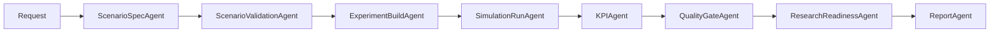

# Submission Architecture

## Summary

| Item | Value |
|---|---|
| project | AV Evaluation Agent |
| backend | FastAPI + LangGraph |
| workflow | n8n |
| simulator | external OpenCDA/CARLA |
| verification | evals + API dry-run |
| submission unit | run folder + manifest |

## Flow

## Endpoints

| Endpoint | Purpose |
|---|---|
| `POST /run/start` | create run |
| `POST /run/prepare/{run_id}` | create execution plan |
| `POST /run/execute/{run_id}` | dry-run or run |
| `GET /run/status/{run_id}` | status |
| `GET /run/result/{run_id}` | manifest |
| `POST /pipeline/submit` | async submit |
| `GET /pipeline/status/{run_id}` | async status |

## Sync And Async

| Mode | File | Use |
|---|---|---|
| sync dry-run | `av_eval_agent_workflow.submission_sanitized.json` | review and demo |
| async submit | `av_eval_agent_async_submit.workflow.json` | long CARLA/OpenCDA run |
| template | `av_eval_agent_workflow.template.json` | editable n8n base |

## Submission Files

| File | Purpose |
|---|---|
| `scenario_definition.json` | structured scenario |
| `scenario_definition_form.csv` | table form |
| `execution_plan.json` | simulator command plan |
| `kpi_plan.json` | KPI command plan |
| `run_manifest.json` | artifact index |
| `quality_gate.json` | pass/review/block |
| `research_readiness.json` | submission readiness |
| `final_run_report.md` | report |

## Review Rules

| Condition | Status |
|---|---|
| all checks pass | ready |
| warning exists | review required |
| simulator failure | blocked |
| KPI missing | blocked |
| artifact missing | blocked |

## Pre-Submission Check

- [ ] evals pass
- [ ] API dry-run pass
- [ ] run manifest exists
- [ ] generated files tracked
- [ ] quality gate status recorded
- [ ] HITL record present when needed
- [ ] external simulator dependency listed
