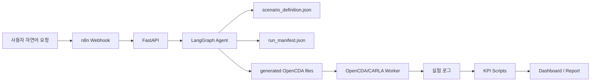

# AV Evaluation Agent 시스템 설계

## 1. 목적

본 시스템은 자연어 시나리오 요청을 받아 자율주행 평가 실험을 준비하고, KPI 산출과 결과 정리를 자동화하는 AI Agent입니다. 평가기관 관점에서는 시험 조건 입력, 시뮬레이터 적용, 결과 저장, 정량 평가, dashboard 표시까지 하나의 흐름으로 관리하는 것을 목표로 합니다.

## 2. 전체 구조



## 3. Agent 노드

| 노드 | 역할 |
| --- | --- |
| requirement_understanding | 자연어에서 시나리오 유형, 속도, V2X 여부, 실행 요청 여부를 추출 |
| scenario_specification | 표준 `scenario_definition.json` 생성 |
| scenario_validate | 누락값, 필수 actor, 기준속도, 통신범위 등을 검증 |
| experiment_planning | 사용할 OpenCDA YAML/PY 템플릿과 실행 전략 결정 |
| kpi_planning | 최종 KPI 축과 계산 정책 결정 |
| approval_gate | 실행 전 사용자 승인 필요 여부 판단 |
| artifact_planning | run_id와 산출물 경로 생성 |

## 4. 데이터 산출물

각 실행은 아래 구조로 저장됩니다.

```text
av_eval_agent/data/runs/{run_id}/
  scenario_definition.json
  run_manifest.json
  agent_state.json
  experiment_plan.json
  kpi_plan.json
  generated_files/
  dashboard/index.html
  report/evaluation_agent_plan.md
```

## 5. 최종 KPI 축

| 평가축 | KPI |
| --- | --- |
| 인지 | MOTA, MOTP |
| 제어 | AccelerationVarianceMax, YawRateResidualRMS |
| 교통 영향성 | ProgressAdjustedDelay, FlowEfficiency |
| 주행 안전성 | Min2DTTC, PET, RequiredDeceleration |

## 6. 안전장치

- 원본 OpenCDA 파일은 수정하지 않습니다.
- 실행 대상은 run별 `generated_files` 복사본으로 제한합니다.
- 누락값이 있으면 `approval_required=true`로 표시합니다.
- AI가 KPI 수치를 임의 생성하지 않고, 실제 로그 기반 계산 스크립트로 산출합니다.
