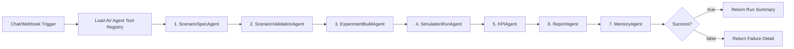

# n8n 기반 AV Evaluation Agent 노드-그래프 설계

## 목표

이 설계는 보여주기용 챗봇이 아니라, 평가기관이 사용할 수 있는 자율주행 평가 자동화 Agent의 MVP 구조를 목표로 한다. n8n은 오케스트레이션 레이어이고, 실제 도메인 작업은 FastAPI/LangGraph 백엔드 Agent endpoint가 수행한다.



## 7개 Agent 역할

| Agent | 실제 API | 역할 | 주요 산출물 |
| --- | --- | --- | --- |
| ScenarioSpecAgent | `POST /agent/scenario-spec` | 자연어 요청을 시나리오 정의서 JSON으로 변환 | `scenario_definition.json`, `scenario_definition_form.csv`, `run_manifest.json` |
| ScenarioValidationAgent | `POST /agent/scenario-validation/{run_id}` | 필수값, 단위, 물리조건, 정의서 누락 확인 | `validation_result.json`, warning/error list |
| ExperimentBuildAgent | `POST /agent/experiment-build/{run_id}` | JSON을 OpenCDA YAML/PY 실행 계획으로 변환 | `execution_plan.json`, command list |
| SimulationRunAgent | `POST /agent/simulation-run/{run_id}` | CARLA/OpenCDA 실행, 로그 저장, 실패 감지 | stdout/stderr log, data dump path, failure status |
| KPIAgent | `POST /agent/kpi/{run_id}` | 인지/제어/교통영향성/주행안전성 KPI 계산 | KPI output directory, result JSON/CSV |
| ReportAgent | `POST /agent/report/{run_id}` | 그래프, 레이더플롯, dashboard, 보고서 생성 | `final_index.html`, `final_run_report.md` |
| MemoryAgent | `GET /agent/memory/{run_id}` | 이전 실험과 비교, 개선 방향 추천 | similar runs, recommendations |

## n8n 템플릿

템플릿 파일:

```text
C:\Users\User\Desktop\OpenCDA - 복사본\av_eval_agent\n8n\av_eval_agent_workflow.template.json
```

템플릿은 다음 원칙으로 구성했다.

| 설계 원칙 | 반영 방식 |
| --- | --- |
| 단일 책임 | 각 n8n 노드는 Agent 1개만 호출 |
| 상태 추적 | 모든 단계가 동일한 `run_id`를 이어받음 |
| 멱등성 | 같은 `run_id`의 manifest/artifact를 갱신하는 방식 |
| 실패 전파 | 앞 단계 실패 시 뒤 Agent는 동일 context를 통과시키고 마지막 IF에서 실패 응답 |
| 관측 가능성 | `events.jsonl`, `runs_index.json`, `run_manifest.json`에 단계별 기록 |
| 배포 유연성 | `AV_AGENT_BASE_URL` 환경변수 또는 `base_url` 입력으로 백엔드 위치 지정 |

## n8n 실행 입력 예시

```json
{
  "user_request": "시나리오2 고속도로 cut-out 상황을 정의서 형식으로 채우고 KPI 계산까지 준비해줘.",
  "execute_simulation": false,
  "run_kpis": true,
  "record": false,
  "base_url": "http://127.0.0.1:8010"
}
```

Docker에서 n8n을 실행한다면 `base_url`을 아래처럼 바꿀 수 있다.

```json
{
  "base_url": "http://host.docker.internal:8010"
}
```

## 백엔드 API 확인

```powershell
Invoke-RestMethod http://127.0.0.1:8010/health
Invoke-RestMethod http://127.0.0.1:8010/agent/tools
```

Agent 단위 수동 테스트:

```powershell
$spec = Invoke-RestMethod -Method Post `
  -Uri "http://127.0.0.1:8010/agent/scenario-spec" `
  -ContentType "application/json" `
  -Body '{"user_request":"시나리오2 고속도로 cut-out 평가 정의서를 작성해줘"}'

$runId = $spec.run_id
Invoke-RestMethod -Method Post -Uri "http://127.0.0.1:8010/agent/scenario-validation/$runId"
Invoke-RestMethod -Method Post -Uri "http://127.0.0.1:8010/agent/experiment-build/$runId" -ContentType "application/json" -Body '{"include_kpis":true,"apply_ml":false,"record":false}'
Invoke-RestMethod -Method Post -Uri "http://127.0.0.1:8010/agent/simulation-run/$runId" -ContentType "application/json" -Body '{"execute_simulation":false,"run_kpis":false,"apply_ml":false,"record":false}'
Invoke-RestMethod -Method Post -Uri "http://127.0.0.1:8010/agent/kpi/$runId" -ContentType "application/json" -Body '{"execute_simulation":false,"run_kpis":false,"apply_ml":false,"record":false}'
Invoke-RestMethod -Method Post -Uri "http://127.0.0.1:8010/agent/report/$runId"
Invoke-RestMethod -Uri "http://127.0.0.1:8010/agent/memory/$runId"
```

## 콘솔

콘솔 URL:

```text
http://127.0.0.1:8010/console/
```

콘솔은 n8n canvas를 대체하지 않는다. 대신 백엔드 Agent 상태, 실행 이력, artifact 경로, node inspector를 보여주는 운영 콘솔이다.
