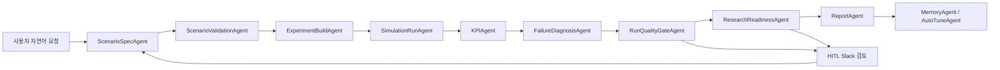

# 자율주행 평가 Agent 연구기관 운영 명세

## 1. 목적

본 Agent는 자연어 시나리오 요청을 받아 자율주행 평가 정의서 형식으로 구조화하고, OpenCDA/CARLA 실험 실행, 로그 저장, KPI 산출, 품질 검증, 최종 보고서 생성까지 일관된 파이프라인으로 처리하는 연구용 평가 시스템이다.

단순 데모가 아니라 연구기관 제출 및 재현 실험을 전제로 하므로 다음 원칙을 따른다.

- 원본 OpenCDA 시나리오 파일은 직접 덮어쓰지 않는다.
- 실행마다 독립 run 폴더를 생성하고, 생성 YAML/PY, 로그, KPI, 보고서, 해시를 보존한다.
- V2X/No V2X 여부와 무관하게 동일 KPI 계약을 적용한다.
- 실행 성공만으로 제출 가능 판정을 내리지 않고, 실패 진단, 품질 게이트, 연구 제출 준비도 검사를 통과해야 한다.
- 경고, 충돌 로그, 센서 오류, 의도와 다른 시나리오 결과는 Human-in-the-loop 검토 대상으로 보낸다.

## 2. Agent 구성

| Agent | 역할 | 주요 산출물 |
| --- | --- | --- |
| PreflightAgent | 서버, 경로, CARLA/OpenCDA 준비 상태 확인 | backend health, tool registry |
| ScenarioSpecAgent | 자연어 입력을 정의서 JSON으로 변환 | `scenario_definition.json`, `scenario_definition_form.csv` |
| ScenarioValidationAgent | 필수값, 단위, 물리 조건, 누락값 검증 | validation result |
| ExperimentBuildAgent | 정의서 JSON을 OpenCDA 실행 파일로 변환 | run-local YAML/PY |
| SimulationRunAgent | OpenCDA/CARLA 실행, 로그 저장, 실패 감지 | `execution_result.json`, `logs/`, `data_dumping/` |
| KPIAgent | 인지, 제어, 교통영향성, 주행안전성 KPI 계산 | `kpi/` |
| FailureDiagnosisAgent | stderr/stdout, 충돌, 센서 경고, dump 누락 진단 | `failure_diagnosis.json` |
| RunQualityGateAgent | 제출 전 품질 게이트 판정 | `quality_gate.json` |
| ResearchReadinessAgent | 연구기관 제출 가능성 감사 | `research_readiness.json`, `research_submission_summary_ko.md` |
| ReportAgent | 최종 보고서 생성 | `final_run_report.md` |
| MemoryAgent | 이전 실험과 비교, 개선 방향 기록 | memory recommendation |
| AutoTuneAgent | 실패/미달 KPI 기반 다음 조정안 제안 | tuning candidates |

## 3. 실행 흐름



## 4. 실행 단위와 재현성

각 실행은 다음 구조로 저장한다.

```text
av_eval_agent/data/runs/{run_id}/
  scenario_definition.json
  scenario_definition_form.csv
  execution_plan.json
  generated/
  logs/
  execution_result.json
  kpi/
  failure_diagnosis.json
  quality_gate.json
  research_readiness.json
  report/
  run_manifest.json
```

재현성을 위해 `ResearchReadinessAgent`는 주요 산출물에 대해 SHA-256 해시를 기록한다. 이 해시는 결과 파일이 제출 후 변경되지 않았는지 확인하는 감사 근거로 사용한다.

## 5. 원본 파일 보호 정책

연구기관 제출용 실험에서는 원본 시나리오 파일을 직접 수정하지 않는다.

- 기준 파일: OpenCDA repository 안의 기존 YAML/PY
- 실행 파일: `av_eval_agent/data/runs/{run_id}/generated/` 아래에 복사/생성
- 안정화 패치: run-local YAML에만 적용
- 패치 기록: `*.stability_patch.json`

예를 들어 Scenario 2 semantic LiDAR 설정이 CARLA에서 불안정한 경우, 원본 YAML은 유지하고 실행용 YAML에서만 `points_per_second`, `rotation_frequency`를 안정 범위로 낮춘 뒤 패치 기록을 남긴다.

## 6. KPI 계약

어떤 시나리오가 들어와도 같은 KPI 축을 사용한다.

| 평가축 | KPI | 방향 |
| --- | --- | --- |
| 인지 | MOTA | 높을수록 좋음 |
| 인지 | MOTP | 낮을수록 좋음 |
| 제어 | Acceleration Variance | 낮을수록 좋음 |
| 제어 참고 | Yaw-rate Residual RMS 또는 Steering RMS | 낮을수록 좋음 |
| 교통영향성 | Progress-adjusted Delay | 낮을수록 좋음 |
| 교통영향성 | Flow Efficiency | 높을수록 좋음 |
| 주행안전성 | min 2D TTC | 높을수록 좋음 |
| 주행안전성 | PET | 높을수록 좋음 |
| 주행안전성 | Required Deceleration | 낮을수록 좋음 |

인지 KPI는 V2X 여부를 직접 비교하는 지표가 아니다. MOTA/MOTP는 YOLO/LiDAR 등 인지 알고리즘 자체의 성능을 평가한다. V2X는 시력이 좋아지는 것이 아니라 협력 정보로 인지 시점과 의사결정 가능 시간을 바꾸는 요소이므로, 협력 인지 효과는 TTC, Required Deceleration, delay, flow 등 다른 KPI에서 해석한다.

## 7. 품질 게이트

`RunQualityGateAgent`는 다음 기준으로 제출 가능 여부를 판단한다.

| 점검 항목 | pass 조건 |
| --- | --- |
| OpenCDA 실행 | 모든 지정 시나리오 return code 0 |
| KPI 계산 | KPI 산출물 생성 완료 |
| Scenario alignment | 정의서 의도와 실행 파일 일치 |
| Failure diagnosis | error 0, warning 0 |
| Artifact manifest | 필수 실행 산출물 경로와 해시 추적 가능 |

경고가 하나라도 있으면 자동 제출하지 않고 `human_review_required`로 둔다. 연구기관 제출에서는 이 보수적 판정이 필요하다.

## 8. Research readiness 판정

`ResearchReadinessAgent`는 품질 게이트보다 한 단계 더 높은 감사 레벨이다.

| 판정 | 의미 |
| --- | --- |
| `research_ready` | 실행, KPI, 진단, 품질 게이트, 산출물 해시가 모두 충족됨 |
| `research_review_required` | 실행은 가능하지만 경고, 충돌, 시나리오 의도 확인 등 연구자 검토가 필요함 |
| `research_blocked` | 실행 실패, KPI 누락, data dump 누락 등 제출 불가 |

현재 최신 실행처럼 OpenCDA는 완료되었지만 sensor lifecycle warning 또는 collision warning이 남으면 `research_review_required`가 정상이다. 이는 Agent가 실패를 숨기지 않고 검토 대상으로 분류한다는 뜻이다.

## 9. HITL 및 Slack 피드백 루프

n8n workflow에서는 품질 게이트 또는 연구 준비도 판정이 review/fail이면 Slack으로 검토 요청을 보낸다.

권장 승인 옵션:

- 승인: 현재 결과를 연구자 검토 완료 상태로 보관
- 재실행: 같은 정의서로 새 run 생성
- 수정 후 재실행: 피드백 내용을 ScenarioSpecAgent 입력으로 되돌림
- 중단: run을 보관하되 최종 제출 대상에서 제외

Slack 응답은 새 자연어 피드백으로 취급해 ScenarioSpecAgent 또는 AutoTuneAgent로 되돌릴 수 있다.

보고서 생성과 제출 가능 판정은 분리한다. 실패나 경고가 있어도 `ReportAgent`는 `final_run_report.md`를 생성한다. 이 보고서는 왜 제출 보류가 필요한지 설명하는 감사 자료이기 때문이다. 대신 `RunQualityGateAgent` 또는 `ResearchReadinessAgent`가 통과하지 못하면 `human_review.submission_gate=review_required`, `submission_blocked=true`로 기록해 외부 제출을 막는다.

## 10. n8n과 LangGraph/FastAPI 역할 분리

n8n은 전체 업무 흐름을 조율하고 사람 검토를 붙이는 orchestration layer이다. 실제 시나리오 해석, 검증, 실행, KPI 계산은 FastAPI backend가 담당하며, 자연어 이해와 정의서 생성 흐름은 backend 내부의 LangGraph `StateGraph`로 관리한다.

| 계층 | 담당 |
| --- | --- |
| n8n | 입력 수신, 노드 그래프, Slack/HITL, 재시도, 외부 시스템 연결 |
| FastAPI + LangGraph backend | Agent endpoint, StateGraph 기반 시나리오 해석, OpenCDA 실행, KPI 계산, 보고서 생성 |
| OpenCDA/CARLA | 실제 시뮬레이션 |
| data/runs | 실행 이력과 재현성 근거 |

이 구조를 쓰면 n8n 화면은 보여주기용이 아니라 실제 Agent API를 호출하는 운영 그래프가 된다.

## 10-1. 장시간 CARLA 실행 처리

CARLA/OpenCDA 실행은 수 분에서 수십 분까지 걸릴 수 있으므로, 운영 환경에서는 동기 웹훅이 전체 실행을 기다리면 안 된다. 이를 위해 별도 비동기 제출 workflow를 둔다.

| 실행 방식 | 사용 파일 | 용도 |
| --- | --- | --- |
| 동기 Agent chain | `av_eval_agent_workflow.submission_sanitized.json` | Agent 구조 검토, 단계별 시연, HITL 리뷰 흐름 확인 |
| 비동기 실행 제출 | `av_eval_agent_async_submit.workflow.json` | 실제 장시간 CARLA/OpenCDA 실행 등록 |

비동기 workflow는 `POST /pipeline/submit`에 `background=true`로 요청하고 즉시 `run_id`, `status_url`을 반환한다. 사용자는 `GET /pipeline/status/{run_id}`로 진행 상황, 산출물, 이벤트 로그를 확인한다.

메인 동기 workflow에 `execute_simulation=true`가 들어오더라도 기본적으로 실제 실행을 억제하고 `long_run_guard.status=sync_execution_suppressed`를 반환한다. 실제 실행은 `av_eval_agent_async_submit.workflow.json`을 사용하는 것이 표준이다. 단, 로컬 디버깅 목적으로만 `force_sync_execution=true`를 명시하면 동기 실행을 허용한다.

## 10-2. Knowledge pack 단일 출처

정의서 필드와 KPI 기준은 n8n과 backend 양쪽에 중복으로 하드코딩하지 않는다. 운영 기준은 backend의 `GET /agent/knowledge-packs`가 단일 출처이며, n8n은 이 endpoint를 우선 호출한다. backend에 일시적으로 접근할 수 없을 때만 n8n fallback pack을 사용하고, 이 경우 `knowledge_pack_warning`을 남긴다.

## 10-3. 인증, retry, 재현성 메타데이터

n8n workflow는 선택형 token gate를 지원한다. 운영 환경에서는 n8n 변수 `AV_AGENT_WEBHOOK_TOKEN` 또는 API gateway를 통해 토큰을 설정하고, 요청자는 `x-av-agent-token` 또는 `auth_token`을 제공해야 한다. 로컬 데모에서는 토큰이 없으면 `auth_required=false`로 기록된다.

백엔드 호출에는 지수 backoff retry wrapper를 적용한다. 일시적인 backend 연결 실패가 곧바로 전체 실험 실패로 이어지지 않도록 하기 위한 장치다.

AutoTuneAgent는 다음 재현성 메타데이터를 run 결과에 기록한다.

| 항목 | 기본값 | 의미 |
| --- | --- | --- |
| `autotune_model` | `gpt-4.1-mini` | 자동 조정 제안에 사용한 모델 |
| `autotune_temperature` | `0.2` | 출력 변동성 제어값 |
| `autotune_seed` | `20260628` | 실험 추적용 seed |
| `model_version_note` | 요청 메타데이터 | 모델 버전/조건 설명 |

LLM seed가 token-level 완전 재현성을 보장하지 않을 수 있으므로, 본 시스템은 입력 정의서, 생성 YAML/PY, KPI 산출물, AutoTune patch 후보, human approval 기록, 산출물 hash를 함께 저장해 연구 재현성을 확보한다.

## 11. 연구기관 제출 전 체크리스트

- [ ] `run_manifest.json` 존재
- [ ] `scenario_definition.json` 및 `scenario_definition_form.csv` 존재
- [ ] 실행용 YAML/PY가 run-local 폴더에 저장됨
- [ ] OpenCDA return code가 모두 0
- [ ] data dump가 현재 실행 시작 이후 생성된 폴더로 고정됨
- [ ] KPI 산출물 생성 완료
- [ ] failure diagnosis에 error가 없음
- [ ] warning이 있으면 HITL 검토 기록이 있음
- [ ] quality gate가 `pass` 또는 검토 사유가 명확한 `human_review_required`
- [ ] research readiness가 `research_ready` 또는 제출자 승인 포함 `research_review_required`
- [ ] 외부 제출 시 `human_review.submission_gate`가 `ready`이거나, `review_required`에 대한 연구자 승인 기록이 있음
- [ ] 장시간 실행 요청은 비동기 workflow 또는 `/pipeline/submit`으로 등록됨
- [ ] 메인 동기 workflow에서 실제 실행 요청이 들어온 경우 `long_run_guard`가 기록됨
- [ ] 운영 배포 시 webhook token 또는 API gateway 인증이 설정됨
- [ ] AutoTune 모델, temperature, seed, model version note가 기록됨
- [ ] 정의서/KPI 기준은 `/agent/knowledge-packs` 기준과 일치함
- [ ] 최종 보고서와 산출물 해시가 보존됨

## 12. 남은 고도화 과제

연구기관 상시 운영 수준으로 가려면 다음 항목을 추가해야 한다.

- 사용자/기관별 접근 권한과 API key 보안 관리
- PostgreSQL 등 영속 DB 기반 실험 이력 관리
- CARLA 서버 상태 모니터링 및 자동 복구
- 장시간 batch 실행 queue와 worker 분리
- KPI threshold의 공식 근거 문서화 및 validation set 확보
- 영상/센서 원본의 대용량 artifact store 연동
- n8n credential export 금지 및 환경변수/secret vault 기반 운영
- 실행 환경 버전 고정: CARLA, OpenCDA, Python, CUDA, YOLO/LiDAR 모델
- 동일 시나리오 반복 실행에 대한 통계 신뢰구간 산출

## 13. 최신 검증 실행

최신 검증 run:

```text
run_20260628_140810_b00e7c8a
```

해당 run은 Scenario 2 V2X/No V2X 새 실행으로 생성되었으며 OpenCDA 실행과 KPI 계산은 완료되었다. 다만 로그 경고가 남아 있어 최종 판정은 `research_review_required`이다.

이 판정은 실패가 아니라 제출 전 연구자 확인이 필요한 상태다. 연구기관용 Agent에서는 이런 보수적 상태 분리가 필수다.
